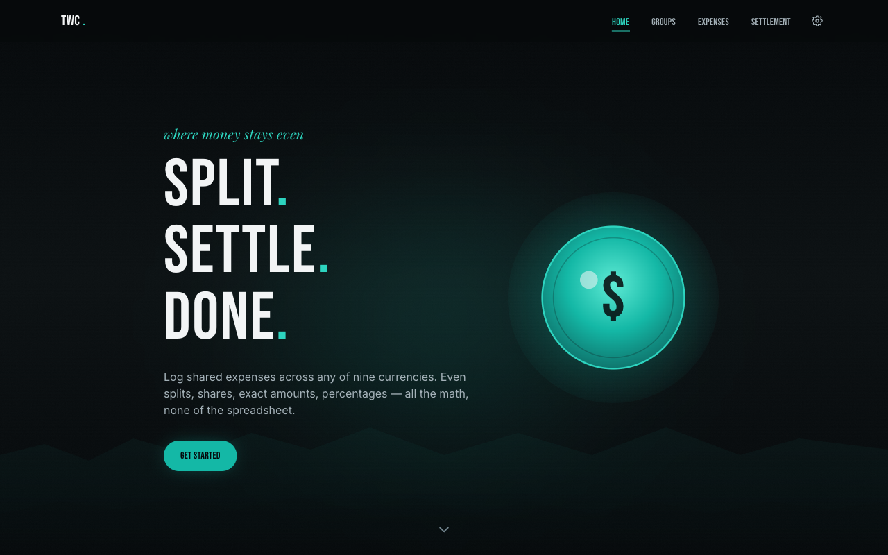
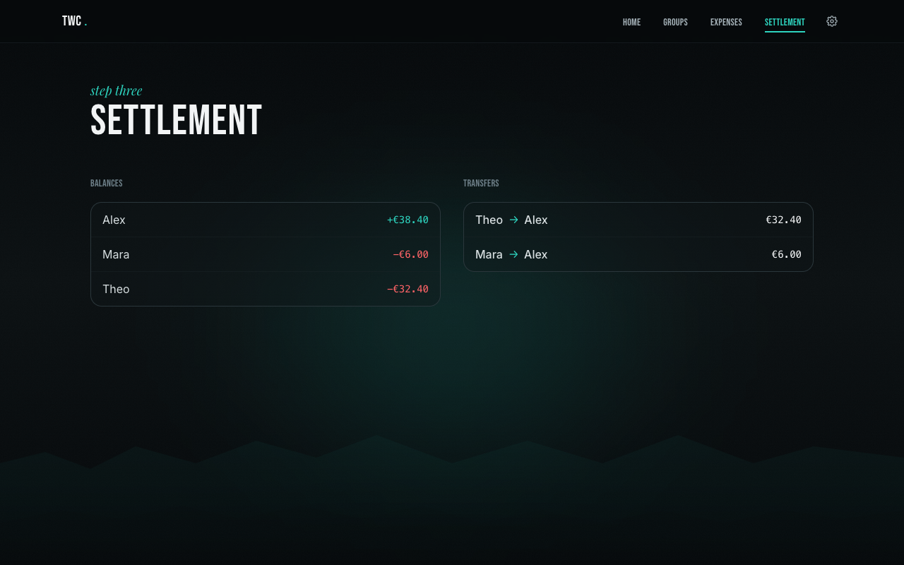
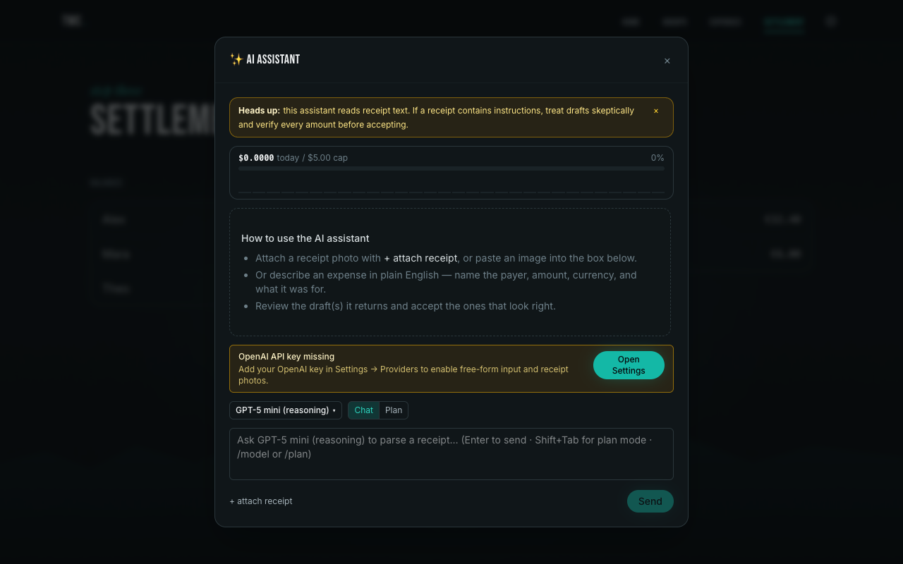
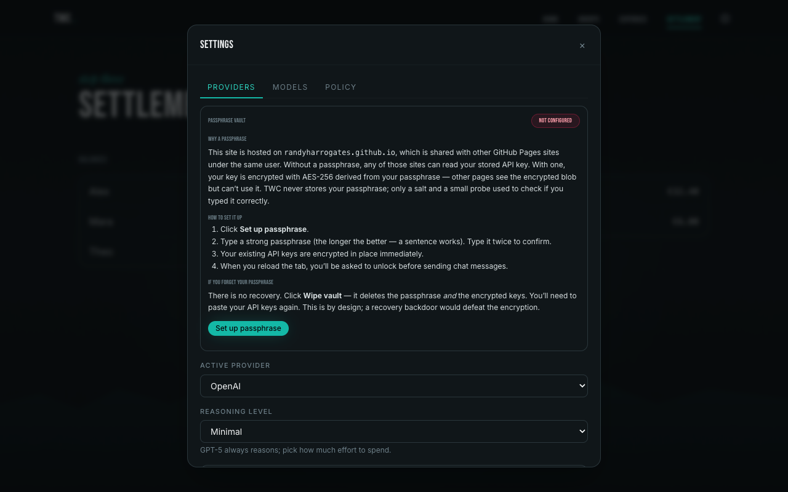
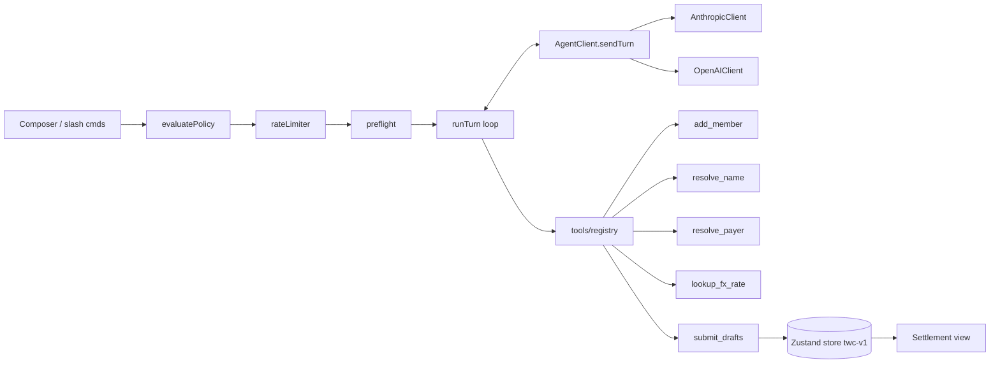

<div align="center">


# TWC

**A frontend-only group-expense splitter with a multimodal chat assistant that reads receipts.**

[](https://randyharrogates.github.io/twc/)
[](https://github.com/randyharrogates/twc/commits/main)
[](LICENSE)
[](package.json)
[](https://vitejs.dev)
[](https://react.dev)
[](https://tailwindcss.com)

**[▶ Live demo — randyharrogates.github.io/twc](https://randyharrogates.github.io/twc/)**

**[▶ Watch the demo video (mp4)](public/TwcDemo.mp4)**

</div>

---

## Table of contents

- [TWC](#twc)
  - [Table of contents](#table-of-contents)
  - [What is TWC?](#what-is-twc)
  - [Features](#features)
    - [Splitting](#splitting)
    - [Currencies](#currencies)
    - [LLM providers](#llm-providers)
    - [Safety rails](#safety-rails)
  - [Screenshots](#screenshots)
  - [Architecture](#architecture)
  - [Quick start](#quick-start)
  - [Chat assistant deep-dive](#chat-assistant-deep-dive)
    - [Slash commands](#slash-commands)
    - [Plan mode](#plan-mode)
    - [Tool registry](#tool-registry)
    - [Streaming phase labels](#streaming-phase-labels)
  - [Bring-your-own API key \& safety rails](#bring-your-own-api-key--safety-rails)
    - [Proxy upgrade path](#proxy-upgrade-path)
  - [Security \& trust](#security--trust)
  - [Development](#development)
    - [Commands](#commands)
    - [Testing](#testing)
  - [Deployment](#deployment)
  - [Contributing](#contributing)
  - [Acknowledgments](#acknowledgments)
  - [License](#license)

---

## What is TWC?

**TWC is a group-expense splitter that runs entirely in your browser.** Create a
group, log who paid for what, pick a per-expense split rule, and read a minimized
"who owes whom" settlement. Money is stored as **integer minor units** (cents / yen /
won) in the expense's native currency and only crosses a float boundary at FX conversion
— always ending in `Math.round`. Settlement math asserts `Σ balances === 0`.

**It also understands receipts.** Open the chat assistant (⌘K), drop in a photo plus
free-form notes, and a vision-capable model (Claude 4.x or GPT-5 / GPT-4.x) runs an
agentic tool loop — resolving member names, looking up FX rates, asking you about
ambiguous payers — and hands back draft expenses for you to review and accept. The
draft pipeline terminates in the same `addExpense` action you'd hit with the form.

**Zero backend, zero auth, zero secrets at rest on a server.** TWC deploys as a static
bundle to GitHub Pages. Real LLM providers are **bring-your-own-key**: you paste an
Anthropic or OpenAI key into Settings, it lives in _your_ `localStorage`, and it is
redacted from exports and never leaves the browser except as a request header. A
Cloudflare Worker proxy is the documented escape hatch if a shared-key mode is ever
needed — not built today.

---

## Features

### Splitting

The four modes all honor the invariant `Σ shares === expense.amountMinor` via the
largest-remainder method (pennies routed to the earliest participants).

| Mode      | Input                                     | Behavior                                                     |
| --------- | ----------------------------------------- | ------------------------------------------------------------ |
| `even`    | participants list                         | Equal shares; remainder cents distributed deterministically. |
| `shares`  | integer weights per participant           | Proportional to weights, then largest-remainder.             |
| `percent` | percentage per participant, Σ = 100       | Proportional to percent, then largest-remainder.             |
| `exact`   | explicit minor-unit share per participant | Sum must equal `amountMinor` or validation rejects.          |

### Currencies

The allow-list is frozen in [`src/lib/currency.ts`](src/lib/currency.ts); do not hardcode
codes, symbols, or decimals elsewhere.

| Code | Name              | Symbol | Minor decimals |
| ---- | ----------------- | ------ | :------------: |
| SGD  | Singapore Dollar  | S$     |       2        |
| MYR  | Malaysian Ringgit | RM     |       2        |
| USD  | US Dollar         | $      |       2        |
| KRW  | Korean Won        | ₩      |       0        |
| JPY  | Japanese Yen      | ¥      |       0        |
| TWD  | New Taiwan Dollar | NT$    |       0        |
| EUR  | Euro              | €      |       2        |
| GBP  | British Pound     | £      |       2        |
| THB  | Thai Baht         | ฿      |       2        |

### LLM providers

Both providers are wired via direct `fetch` — no SDK. Models and prices live in
[`src/lib/llm/models.ts`](src/lib/llm/models.ts); each entry carries a
`lastVerifiedIso` and CI fails once an entry is >365 days old.

| Provider      | Models                                                | Streaming | Tool use | Thinking / reasoning                                                              |
| ------------- | ----------------------------------------------------- | :-------: | :------: | --------------------------------------------------------------------------------- |
| **Anthropic** | Claude Haiku 4.5, Sonnet 4.6, Opus 4.7                |     ✔     |    ✔     | Optional extended thinking via `thinking: { budget_tokens }`                      |
| **OpenAI**    | GPT-5, GPT-5 mini, GPT-4.1, GPT-4.1 mini, GPT-4o mini |     ✔     |    ✔     | Intrinsic reasoning on GPT-5 family (`reasoning_effort`, `max_completion_tokens`) |

### Safety rails

| Rail                       | Detail                                                                                                                    |
| -------------------------- | ------------------------------------------------------------------------------------------------------------------------- |
| Rate limiter               | 10 requests / minute and 100 / hour (defaults, configurable). Persists across reloads so refresh cannot bypass.           |
| Spend caps                 | Per-day and per-month µUSD caps checked against `costTracker` before every send.                                          |
| Image consent              | One-time per-provider modal before the first image upload; explains what bytes are sent.                                  |
| Magic-byte MIME check      | JPEG / PNG / WebP enforced by both declared MIME _and_ actual header bytes.                                               |
| Preflight                  | Estimates tokens and rejects over-context-window or >5 MB encoded-image requests without spending a quota.                |
| Image bytes in memory only | Uploaded images live in an in-memory `Map`; persisted messages keep `base64: ''` and render as placeholders after reload. |
| API keys redacted          | Keys never appear in request bodies, logs, or `exportState()` — only on the request headers.                              |

---

## Screenshots






---

## Architecture



**Money invariant.** Every amount in TWC is an integer minor-unit in its own currency.
The only sanctioned float boundary is FX conversion in `src/lib/currency.ts`, which
always ends in `Math.round`. Every proportional split preserves
`Σ shares === expense.amountMinor` via largest-remainder; every settlement asserts
`Σ balances === 0` in base-currency minor units and throws on violation.

---

## Quick start

```sh
npm install
npm run dev        # http://localhost:5173/twc/
npm run test       # vitest run (34 test files)
npm run build      # tsc -b && vite build
npm run lint       # eslint .
npm run preview    # serve dist/ locally
```

<details>
<summary><strong>Prerequisites</strong></summary>

- Node ≥ 20 and npm.
- A modern browser. `localStorage` and `crypto.randomUUID()` are required.
- An Anthropic or OpenAI API key if you want the chat assistant; without one, the app
  still runs as a plain expense splitter.

</details>

<details>
<summary><strong>Get an Anthropic API key</strong></summary>

1. Create or sign in at [console.anthropic.com](https://console.anthropic.com/).
2. Generate a key under **API Keys**.
3. Paste it into **Settings → Providers → Anthropic** in the app.

TWC sends requests directly from your browser using the
`anthropic-dangerous-direct-browser-access: true` header. The key goes on
`x-api-key`, never in the request body.

</details>

<details>
<summary><strong>Get an OpenAI API key</strong></summary>

1. Create or sign in at [platform.openai.com](https://platform.openai.com/).
2. Generate a key under **API keys**.
3. Paste it into **Settings → Providers → OpenAI** in the app.

Reasoning models (GPT-5 family) use `max_completion_tokens` and `reasoning_effort`
instead of `max_tokens` / `temperature` — TWC handles the switch for you based on
`isReasoningModel(id)`.

</details>

---

## Chat assistant deep-dive

Open with **⌘K** (or Ctrl+K). Attach up to a small number of JPEG / PNG / WebP
receipts, type free-form notes, and send. The assistant runs an agentic loop with a
32-iteration default cap that mirrors claw-code's `DEFAULT_AGENT_MAX_ITERATIONS`.

### Slash commands

Dispatched pre-send by
[`slashCommands.ts`](src/components/chat/slashCommands.ts).

| Command                   | Effect                                           |
| ------------------------- | ------------------------------------------------ |
| `/plan` \| `/plan toggle` | Toggle plan mode (same as Shift+Tab).            |
| `/plan on` \| `/plan off` | Set plan mode explicitly.                        |
| `/model`                  | Show the active model.                           |
| `/model <id>`             | Switch the active model; also sets the provider. |

### Plan mode

**Shift+Tab** in the composer toggles plan mode. Under plan mode, `add_member` and
`submit_drafts` are _physically_ removed from the tool list — the model cannot emit
those calls because the schemas aren't sent. A `PLAN MODE (active)` block is also
appended to the system prompt. When a plan-mode turn ends, the last-assistant bubble
gets an **Execute this plan** button; clicking it re-runs the last user text with both
mutating tools re-enabled, without touching the global plan-mode setting.

### Tool registry

Primary specs come from
[`primaryToolSpecs(group, planMode)`](src/lib/llm/tools/registry.ts); executor via
`createAgentExecutor(group, deps)`.

| Tool             | Purpose                                                                                                |
| ---------------- | ------------------------------------------------------------------------------------------------------ |
| `add_member`     | Add a new member to the active group. Mutating — goes through `PermissionPrompter`.                    |
| `resolve_name`   | Fuzzy-match a name to an existing member id.                                                           |
| `resolve_payer`  | Ask the user (via `PayerPromptDialog`) to disambiguate which member paid. Interactive, not mutating.   |
| `lookup_fx_rate` | Prompt the user (via `RateInputDialog`) for an FX rate, write it to the group rate cache. Interactive. |
| `submit_drafts`  | Emit a final array of expense drafts that hydrate into `DraftCard`s. Gated by plan mode.               |

### Streaming phase labels

`PendingBubble` renders a phase label next to the streaming cursor, driven by the
`onPhase` callback threaded through `runTurn`. A live elapsed-time readout ticks so
long tool loops don't feel frozen; the final `elapsedMs` persists on the assistant
message alongside `usage` / `modelId`.

| Phase kind            | Surfaced as                                                         |
| --------------------- | ------------------------------------------------------------------- |
| `starting`            | `starting…`                                                         |
| `thinking`            | `thinking…`                                                         |
| `calling_tool:<name>` | `resolving name…`, `looking up FX rate…`, `preparing drafts…`, etc. |
| `tool_done:<name>`    | Bubble flips back to the next phase or to streaming text.           |

---

## Bring-your-own API key & safety rails

Both providers ship in **BYO-key** mode. You paste a key you control; TWC stores it in
your browser's `localStorage` under `twc-v1` at `settings.apiKeys.{anthropic|openai}`.

- **Entry surface.** `Settings → Providers → <provider>`. Keys are masked unless you
  click Reveal, and auto-re-mask on blur. `APIKeyHelpPanel` ships the mandated three
  pieces: generation instructions, security disclosure, clear-key guidance.
- **Redaction.** `exportState()` replaces `apiKeys` values with empty strings. Keys
  never appear in request bodies, `console.log`, or any diagnostic output — only as
  request headers.
- **Clear a key.** `Settings → Providers → Clear key`, or delete
  `settings.apiKeys.<provider>` via DevTools → Application → Local Storage → `twc-v1`.

### Proxy upgrade path

If a shared-key mode is ever needed, a ~60-line Cloudflare Worker can inject the key
server-side and forward to Anthropic / OpenAI. `ChatPanel.tsx` instantiates the
provider directly today
(`provider === 'anthropic' ? new AnthropicClient({...}) : new OpenAIClient({...})`);
adding a proxy mode means extending that conditional with a third branch that
constructs a `ProxyClient` against the worker URL. Not built now; documented here.

---

## Security & trust

TWC is published at <https://randyharrogates.github.io/twc/>. Before pasting an API key
into a stranger's webpage, you deserve to know how the project handles it.

**Threat model in one paragraph.** There is no server and no auth. Requests go directly
from your browser to Anthropic / OpenAI with your own API key on the `x-api-key` /
`Authorization` header. TWC has no telemetry, no analytics, no third-party scripts
beyond Google Fonts (CSS only — the CSP forbids third-party script sources). `npm audit`
is green; every dependency is pinned; no `dangerouslySetInnerHTML`. All image parsing
runs through a magic-byte verifier before encoding.

**The shared-origin risk.** `randyharrogates.github.io` is a single origin shared by
every GitHub Pages site under the user. `localStorage` is origin-scoped, so a sibling
page at `randyharrogates.github.io/<other-site>/` can read TWC's `twc-v1` entry. If your
API key is stored in plaintext, that sibling page can exfiltrate it.

**Passphrase vault.** To close that gap, TWC includes a passphrase-based vault (opt-in)
that encrypts `settings.apiKeys.<provider>` at rest. Implementation:

- PBKDF2-SHA256 with a **per-user 16-byte random salt**, **600,000 iterations** — using
  the same PBKDF2 + AES-GCM parameters as a prior project.
- AES-GCM 256-bit key, 12-byte random IV per encrypted value.
- Tagged-string ciphertext: `enc.v1.<iv_base64>.<ct_base64>`. Anything that doesn't
  start with `enc.v1.` is plaintext.
- The passphrase is **never persisted**. Only a salt, iteration count, and a small
  probe (a known plaintext encrypted with the derived key) are saved. The probe lets
  `unlock(passphrase)` verify a candidate passphrase without checking against real key
  material.
- The derived `CryptoKey` lives only in `KeyVault`'s private memory for the session.
  Lock the tab (or close it) and the key disappears; the next send prompts for the
  passphrase again.

**What the vault protects against.** A sibling shared-origin site can read the ciphertext
blob from `localStorage`, but it cannot decrypt without your passphrase. That is the only
meaningful mitigation available to a pure-frontend app on a shared origin. For stronger
isolation, deploy under a custom domain you control — then the origin is no longer shared.

**What the vault does _not_ protect against.** XSS on `randyharrogates.github.io/twc/`
itself (e.g. via a compromised npm dependency that runs inside TWC's page context) can
read the derived `CryptoKey` from memory _while the vault is unlocked_. Treat unlock as a
session permission: unlock, send, lock when you step away.

**Clear or wipe.**

- **Clear a key**: Settings → Providers → `Clear key`, or DevTools → Application →
  Local Storage → `twc-v1` → remove `settings.apiKeys.<provider>`.
- **Wipe the vault**: Settings → Security → `Wipe vault`. This deletes the passphrase
  meta AND all encrypted keys. Forgetting a passphrase is unrecoverable by design; a
  backdoor would defeat the encryption.

Source: [`src/lib/crypto.ts`](src/lib/crypto.ts),
[`src/lib/keyVault.ts`](src/lib/keyVault.ts),
[`src/components/SecurityPanel.tsx`](src/components/SecurityPanel.tsx).

---

## Development

<details>
<summary><strong>Directory layout</strong></summary>

```
src/
├── lib/                Pure logic. No React, no DOM, no localStorage.
│   ├── currency.ts     9-code allow-list, parseAmountToMinor, formatMinor, convertMinor
│   ├── splits.ts       even / shares / percent / exact with largest-remainder
│   ├── settlement.ts   Σ balances === 0 invariant
│   ├── policy.ts       evaluatePolicy — spend caps, allowed providers, image consent
│   ├── rateLimiter.ts  10/min + 100/hr token bucket, persists
│   ├── validation.ts   Zod-ish schemas for form input
│   ├── fuzzy.ts        Fuzzy member-name matcher used by resolve_name
│   └── llm/
│       ├── agent.ts          AgentClient interface + runTurn loop
│       ├── anthropicClient.ts, openaiClient.ts
│       ├── models.ts         8 models, µUSD pricing, lastVerifiedIso
│       ├── cost.ts           µUSD math, exactly 2 Math.round boundaries
│       ├── preflight.ts      Token estimation + context-window check
│       ├── prompt.ts         buildAgentSystemPrompt
│       ├── conversation.ts   pruneHistory at 60% of context window
│       ├── schema.ts         Zod + toJsonSchema (strict)
│       └── tools/            registry, add_member, resolve_name, resolve_payer,
│                             lookup_fx_rate, submit_drafts
├── state/
│   ├── store.ts        Zustand + persist, twc-v1, version 7
│   └── imageCache.ts   In-memory Map — never persisted
├── components/
│   ├── chat/           ChatPanel, Composer, MessageList, DraftCard, PendingBubble,
│   │                   TokenCostBar, ToolUseBubble, slashCommands
│   └── ui/             Button, Input, Dialog, NumberInput — zero domain knowledge
└── test/               34 Vitest files, mirrors src/** one-to-one
```

Each subdirectory has its own `CLAUDE.md` with local rules — read the one closest to
the file you're editing.

</details>

### Commands

| Command              | What it does                                     |
| -------------------- | ------------------------------------------------ |
| `npm run dev`        | Vite dev server at `http://localhost:5173/twc/`. |
| `npm run build`      | `tsc -b && vite build` → `dist/`.                |
| `npm run test`       | `vitest run` (34 files, mirrors `src/**`).       |
| `npm run test:watch` | Vitest in watch mode.                            |
| `npm run test:ui`    | Vitest UI.                                       |
| `npm run lint`       | `eslint .`                                       |
| `npm run preview`    | Serve the built `dist/` locally.                 |

### Testing

Tests live in [`src/test/`](src/test) and mirror `src/lib/` and `src/state/`
one-to-one (`lib/money.ts` → `test/money.test.ts`). Rules of thumb:

- Name tests as **behavior**, not function shape.
- No snapshot tests for logic — assert exact values.
- FX and split-rounding tests must cover both 0-decimal (JPY / KRW / TWD) and
  2-decimal (USD / EUR / etc.) currencies.
- LLM-chat tests include at least one 0-decimal case so prompt/schema regressions
  break CI.
- Every provider-client test asserts the API key never appears in the request body.

---

## Deployment

- **GitHub Pages** via [`.github/workflows/deploy.yml`](.github/workflows/deploy.yml) on
  push to `main`.
- Vite `base: '/twc/'` makes the bundle path-portable under the repo's Pages subpath.
- Build artifact is `dist/`; the workflow uploads it as a Pages artifact and deploys.

No secrets are required in CI — there is no backend and no shared API key. Users
bring their own keys at runtime.

---

## Contributing

- **Conventional Commits.** `feat:` / `fix:` / `refactor:` / `chore:` / `test:` /
  `docs:`. **No Claude / Anthropic attribution** in commit messages or PR bodies (TWC
  rule).
- **Per-directory `CLAUDE.md` rulebooks** — read the closest one before editing.
  The root [`CLAUDE.md`](CLAUDE.md) links each nested rulebook.
- **Money invariant is non-negotiable.** Integer minor units everywhere; floats only
  at the FX-conversion boundary in `src/lib/currency.ts`; `Σ shares` and `Σ balances`
  invariants apply.
- **Never commit API keys.** `.env` files with real keys, a pasted key in a test
  fixture, or a leaked header in a log are all bugs.
- See [`CHANGELOG.md`](CHANGELOG.md) for a version-by-version log.

---

## Acknowledgments

TWC's agent runtime is heavily inspired by
[**claw-code**](https://github.com/ultraworkers/claw-code) — its `ConversationRuntime`
and turn-loop semantics shaped the `AgentClient` interface, the `runTurn` driver, the
32-iteration iteration cap, and the preference for direct `fetch` over vendor SDKs in
`anthropicClient.ts` / `openaiClient.ts`. Where claw-code's Rust/CLI patterns didn't
fit TWC's browser-only, frontend-only constraints, the adaptation is called out in
design notes; otherwise the patterns are reused as-is.

---

## License

[MIT](LICENSE) © 2026 Randy Chan. See the [`LICENSE`](LICENSE) file for the full text.
